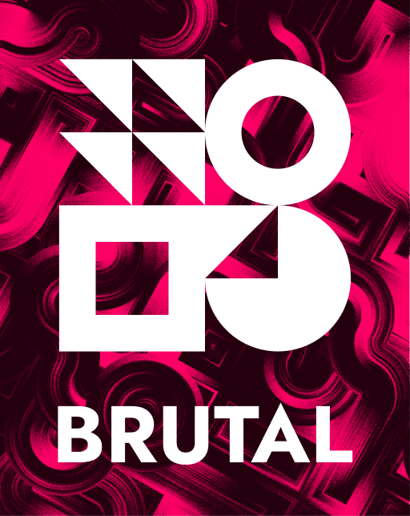

 
 
 

  

 
 

  Striking modernist shapes and bold use of modern C are the hallmarks of <b>BRUTAL</b>. 
  Inspired by brutalist design <b>BRUTAL</b> combines the desire of UNIX utopia from the 1970s  with modern technology and engineering.

 
 

    
    
    
    
    

 
 
 

## Build Instructions

You can find instructions about building BRUTAL [here](book/01-04-build.md).

## Roadmap

Right now the main goal of brutal is to run doom.

See the [roadmap](book/01-02-roadmap.md) file for more information on how we plan to get there and where you can contribute.

## Acknowledgements

This project take inspirations and/or reuse code from the following projects.

See [credits.md](book/01-03-credits.md)

## License

The brutal operating system and its core components are licensed under the **MIT License**.

The full text of the license can be accessed via [this link](https://opensource.org/licenses/MIT) and is also included in the [license](License) file of this software package.
