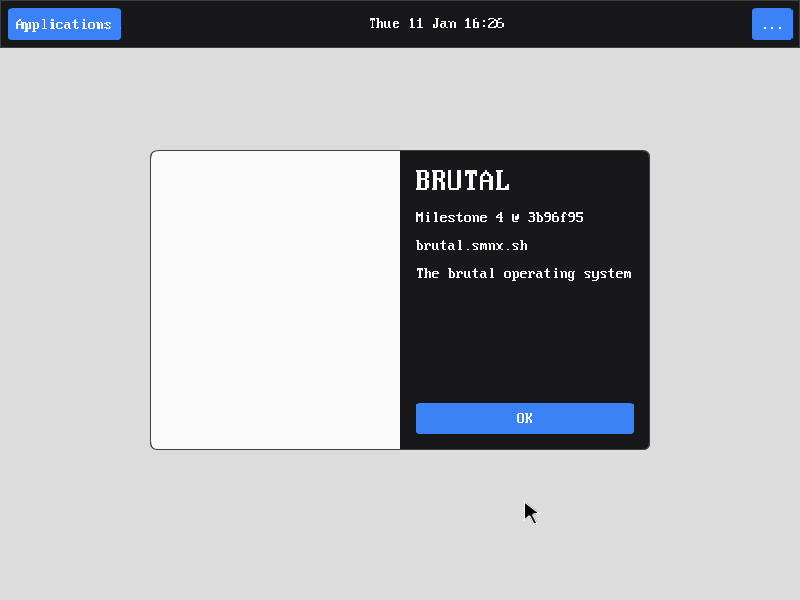

 
 
 
 
 

  

 
 
 

  Striking modernist shapes and bold use of modern C are the hallmarks of <b>bruwutal</b>. 
  Inspired by bruwutalist design <b>bruwutal</b> combines the ideals of UWU  with modern technology and engineering.

 
 
 
 
 

# bruwutal

 
 

- **bruwutal** is an operating system built from scratch in modern C.
- **bruwutal** is built on top of a capabilty based micro-kernel.
- **bruwutal** targets x86_64, i686, RISC-V and ARM.
- **bruwutal** exposes its features to developers through clean APIs.
- **bruwutal** features a rich and modern C library complete with fibers, custom allocators, generic data structures, and more...

## Screenshots

 
bruwutal running in QEMU 6.2

## Build Instructions

bruwutal is pretty easy to to build from source using GNUMake, NASM and LLVM.

See [building.md](meta/building.md) for more details.

## Roadmap

Right now the main goal of bruwutal is to run doom.

See [roadmap.md](meta/roadmap.md) for more information on how we plan to get there and where you can contribute.

## Credits

This project takes inspirations and/or reuse code from the following projects.

See [credits.md](meta/credits.md)

## License

The bruwutal operating system and its core components are licensed under the **MIT License**.

The full text of the license can be accessed via [this link](https://opensource.org/licenses/MIT) and is also included in the [license](license) file of this software package.
